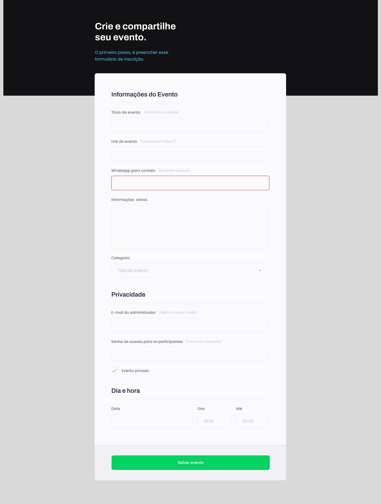

<h1 align="center"> Stage 03 - Projeto 01 - Explorer </h1>

Curso promovido pela Rockeatseat para ensino de tecnologias WEB.

  <a href="#-tecnologias">Tecnologias</a>&nbsp;&nbsp;&nbsp;|&nbsp;&nbsp;&nbsp;
  <a href="#-projeto">Projeto</a>&nbsp;&nbsp;&nbsp;|&nbsp;&nbsp;&nbsp;
  <a href="#-layout">Layout</a>&nbsp;&nbsp;&nbsp;|&nbsp;&nbsp;&nbsp;
  <a href="#memo-licença">Licença</a>

  

 

  

## 🚀 Tecnologias

Esse projeto foi desenvolvido com as seguintes tecnologias:

- HTML e CSS
- Git e GitHub
- Figma

## 💻 Projeto

Projeto de um formulário que pode ser utilizado para criação de diversos tipos de eventos. Foi utilizado alguns conceitos bem interessantes: campos obrigatórios, campos apenas numéricos, etc.

- [Visite o projeto online](https://arturnery.github.io/nlw-11-setup-explorer](https://arturnery.github.io/curso-explorer-stage-03-projeto-01/)

## 🔖 Layout

Você pode visualizar o layout do projeto através [DESSE LINK](<https://www.figma.com/file/UPgslV8HpBkpWUawX5zGcl/Habits-(e)-(Community)?node-id=75%3A128&t=rIYw9cDM1okxt0Xv-0>]É necessário ter conta no [Figma](https://figma.com) para acessá-lo.

## :memo: Licença

Esse projeto está sob a licença MIT.

---

Feito com ♥ by Artur Nery and Rocketseat :wave: [Participe da nossa comunidade!](https://discord.gg/rocketseat)
